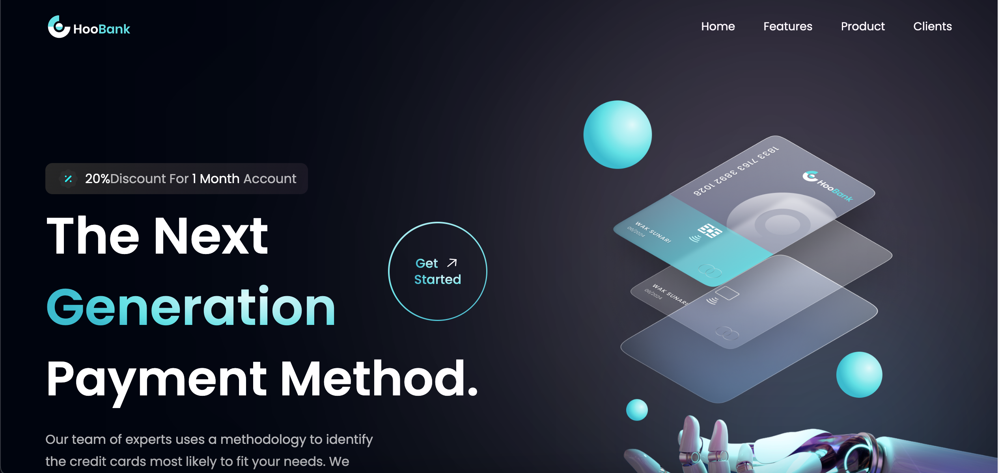

# Banking App

  

## About

In this project, the learner is building a fintech landing page using two popular front-end technologies: TailwindCSS and React.js. TailwindCSS is a utility-first CSS framework that allows developers to quickly build custom user interfaces, while React.js is a popular JavaScript library for building web applications.

The fintech landing page project will involve creating a visually appealing and user-friendly website that highlights the features and benefits of a fintech product or service. The project will require the use of TailwindCSS classes to style and layout the website components, and React.js to create dynamic and interactive user interfaces.

The project will likely involve the use of various React.js features such as components, state management, and event handling, as well as the integration of third-party libraries and tools such as React Router and Axios for routing and data fetching respectively.

Overall, this project provides a great opportunity for learners to gain hands-on experience with two powerful front-end technologies, while building a practical and useful project that can be showcased in a portfolio or used as a basis for further development.